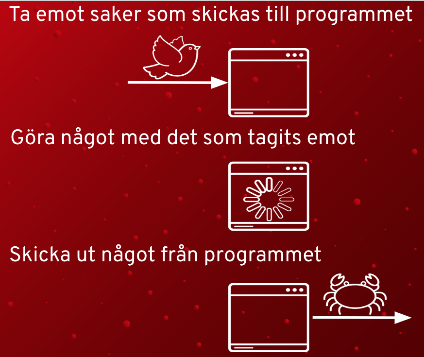
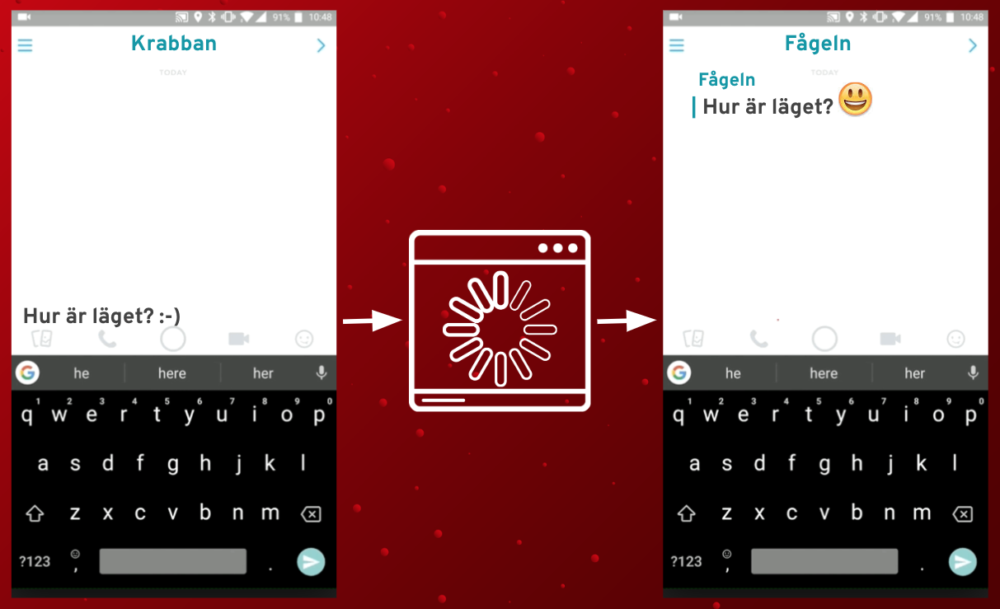
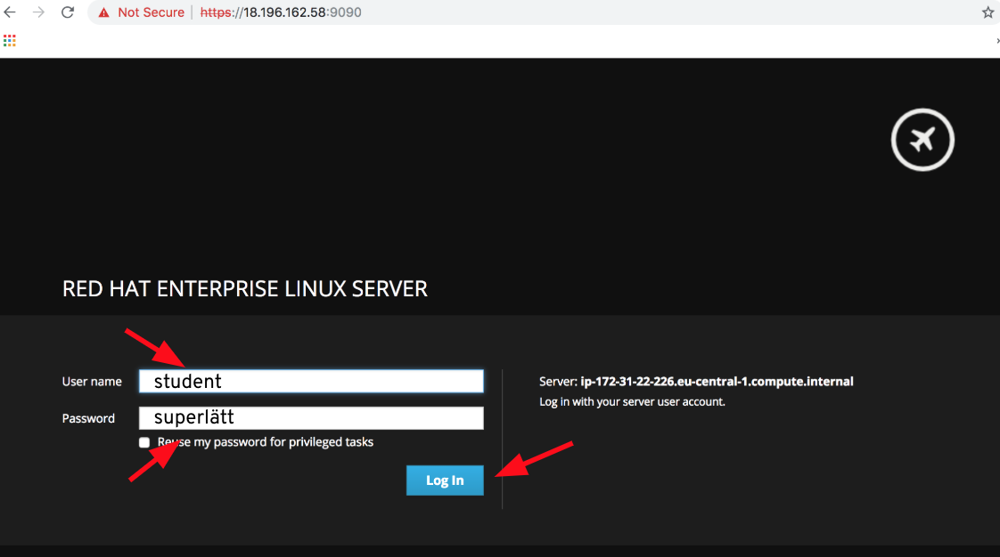
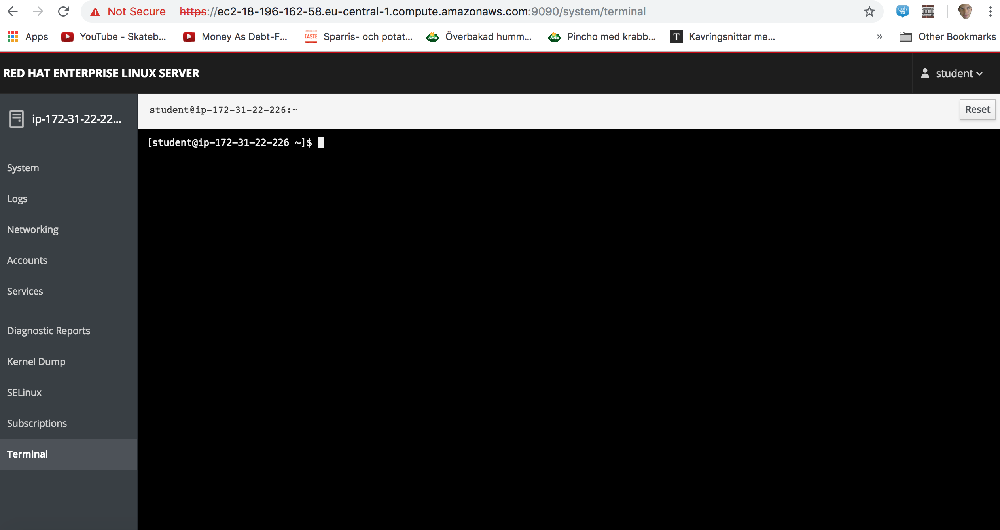

# Kapitel 1: Teori om datorprogram

## Vad är ett datorprogram?

[Gå hit för att se svaret](svar/svar1.md)

## Kan du ge exempel på olika datorprogram?

[Gå hit för att se svaret](svar/svar2.md)

## Kan du ge exempel på olika saker som fungerar tack vare datorprogram?

[Gå hit för att se svaret](svar/svar3.md)

## Grunderna i ett vanligt datorprogram



## Hur skriver man ett datorprogram?

Datorprogram består av programkod (vanlig text som ser lite kryptisk ut). Programkoden berättar för datorn hur programmet fungerar. Precis som i vanligt skrivet språk, så finns det också olika programmeringsspråk, som alla ser lite olika ut.
Nedanför är exempel på hur man får dataprogram att skriva "Hejsan!", men i tre olika programmeringsspråk.
```
echo Hejsan!
```
```
printf("Hejsan!");
```
```
print "Hejsan"
```

## När något går fel i ett datorprogram

När ett dataprogram inte fungerar som det ska, så säger man ofta att programmet har en `bugg`. Det är då för att personen som skrivit programmet har skrivit fel. Det är vanligt att ett datorprogram är tiotusentals rader med text och en del program är flera miljoner rader med text, så det är inte konstigt att det kan bli fel.

## Exempel från ett känt datorprogram


Hur fungerar snapchat? Som ett vanligt datorprogram, i grunden. Det vill säga:
* Snapchat tar emot något
* Snapchat gör något med det som tagits emot
* Snapchat skickar ut något

Mer i detalj, det som händer är att:
* Du skriver något eller tar en bild. Snapchatprogrammet tar emot det.
* Snapchatprogrammet ser till att din bild ser extra skoj ut eller lägger till emojis i din text.
* Snapchatprogrammet skickar meddelandet till din kompis.



# Kapitel 2: Skriv ditt eget datorprogram!

## Anslut till datorn som du ska programmera på
1. Du har fått ett papper där det står adressen till en webbsida. Gå till den.
2. Logga in med användarnamnet `student` och lösenordet `superlätt` och klicka på knappen som läser `Log in`, som på bilden nedanför.



3. Klicka på menyn till vänster som läser `terminal`. När du gjort det så kommer det se ut som på bilden nedanför.


## Skriv ditt första dataprogram
1. Nu är vi redan att skriva vårt första datorprogram, det är ett enkelt program som skriver en bit text. I den svarta delen av skärmen skriv nedan:
```
cat >mittprogram
echo Det är skoj att gå i skolan
```
2. Tryck sedan `ctrl+c`.

3. Skriv nedan på skrämen för att köra ditt dataprogram.
```
sh ./mittprogram
```
4. Se hur ditt datorprogram skrev ut det du bestämde på skärmen! Hurra :smile:

## Från och med nu så får du fritt pröva att skriva lite olika dataprogram. 
Nedan så följer lite exempel som du kan pröva:

* Ett datorprogram som skriver lite olika texter
```
echo Hejsan alla
echo Jag vet inte vad jag ska skriva här!
echo Här kommer ännu mer text
```

* Ett datorprogram som skriver en text flera gånger
```
for i in {1..100}
do
echo Är det inte rast än?
done
```

* Ett datorprogram som frågar efter vad du gillar
```
read -p "Vad gillar du mest?" SVAR
echo Jag gillar också $SVAR
```

* Mer advancerat: Ett datorprogram som frågar efter vad du gillar och om du gillar glass, så blir programmet extra glatt, annars inte...
```
read -p "Vad gillar du? " SVAR
if [ "$SVAR" == "glass" ]
then
echo Jag gillar också glass!
else
echo Jag gillar inte $SVAR :(
fi
```

* Överkurs: Hitta på ett helt egna datorprogram :smile:
